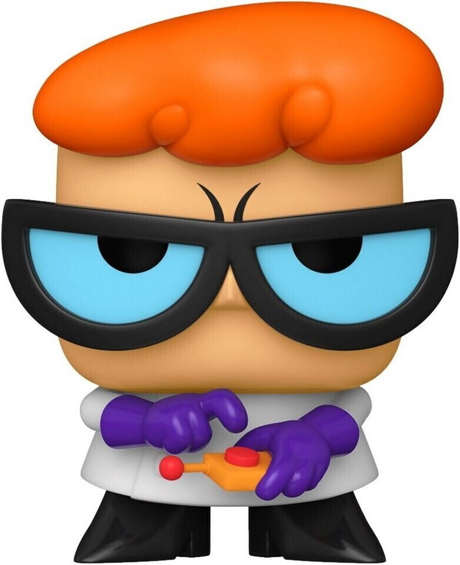
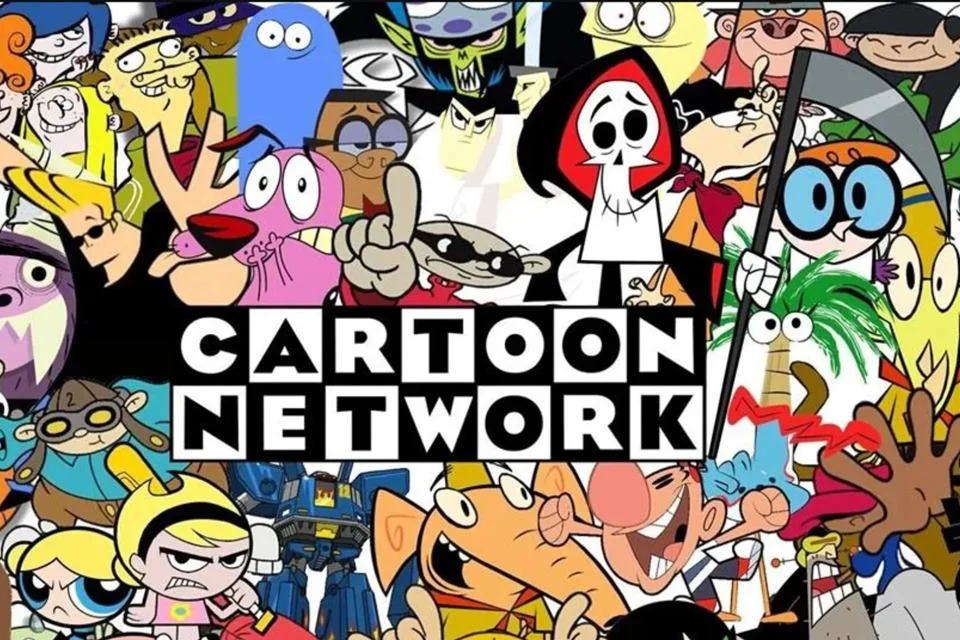
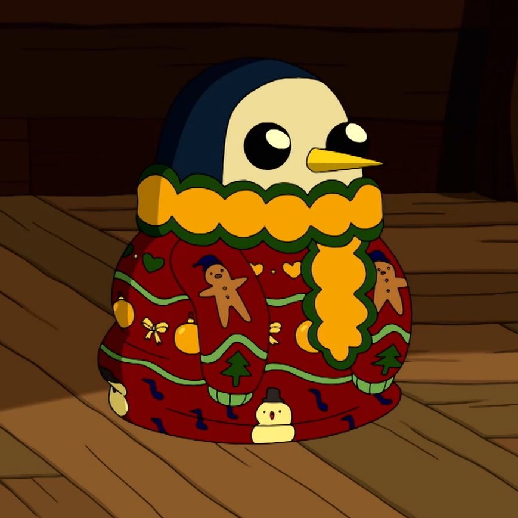
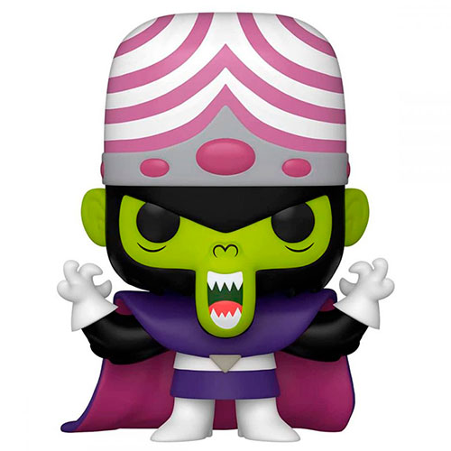
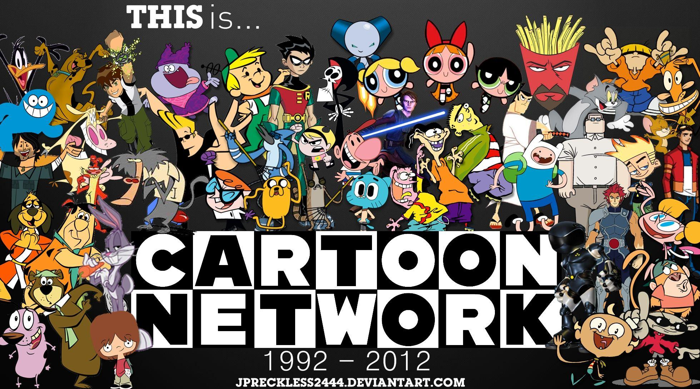

# Tareawebb2
<!DOCTYPE html>
<html lang="es">
<head>
  <meta charset="UTF-8">
  <meta name="viewport" content="width=device-width, initial-scale=1.0">
  <title>Cartoon Network</title>
  <link href="https://fonts.googleapis.com/css2?family=Montserrat:wght@300;400;700&family=Open+Sans:wght@300;400;700&display=swap" rel="stylesheet"> 
  <link rel="stylesheet" href="reset.css">
  <link rel="stylesheet" href="head.css">
  <link rel="stylesheet" href="pagina.css">
  <link rel="stylesheet" href="elemento.css">
  <link rel="stylesheet" href="mensaje.css">
  <link rel="stylesheet" href="footer.css">
  <link rel="stylesheet" href="imagen.css">
  <link rel="stylesheet" href="nosotros.css">
  <link rel="stylesheet" href="producto.css">
  <link rel="stylesheet" href="contacto.css">
  <link rel="stylesheet" href="cuerpo.css">
</head>
<body>

    <header class="head">
        
        <nav class="head__nav">
          <ul>
            <li class="head__link"><a href="index.html">Inicio</a></li>
            <li class="head__link"><a href="https://www.max.com/bo/es/channel/cartoon-network">Programación</a></li>
            <li class="head__link"><a href="https://www.yidio.com/channel/cartoon-network">Shows</a></li>
            <li class="head__link"><a href="https://www.cartoonnetwork.co.uk/">Videos</a></li>
            <li class="head__link"><a href="https://www.numeroservicioalcliente.com/cartoon-network/">Contacto</a></li>
          </ul>
        </nav>
      </header>
      <main>
      
    
<section class="pagina">
  <h1 class="pagina__titulo">Bienvenido a Cartoon Network</h1>
  
El hogar de la diversión, la creatividad y las aventuras animadas. ¡Explora nuestros shows y descubre un mundo de sorpresas!

  <a class="pagina__boton" href="https://www.gatotv.com/canal/cartoon_network">Ver Programación</a>
</section>

    

<section class="elemento">
    <h2 class="elemento__titulo">Shows Destacados</h2>
    

      <figure class="elemento__figura">
        
        <figcaption class="elemento__figura--texto">HORA DE AVENTURA 10:45</figcaption>
      </figure>
      <figure class="elemento__figura">
        
        <figcaption class="elemento__figura--texto">DEXTER 11:35</figcaption>
      </figure>
      <figure class="elemento__figura">
        
        <figcaption class="elemento__figura--texto">MOJOJOJO 12:25</figcaption>
      </figure>
    

    <a class="elemento__boton" href="https://www.max.com/bo/es/channel/cartoon-network">Ver Todos los Shows</a>
  </section>
  

  <section class="mensaje">
    <ul class="mensaje__lista">
      <li class="mensaje__item">
        <h2 class="mensaje__item__titulo">Diversión</h2>
        
Un universo de entretenimiento para todas las edades.

      </li>
      <li class="mensaje__item">
        <h2 class="mensaje__item__titulo">Creatividad</h2>
        
Historias originales y personajes icónicos que inspiran imaginación.

      </li>
      <li class="mensaje__item">
        <h2 class="mensaje__item__titulo">Aventura</h2>
        
Cada show es una nueva aventura llena de sorpresas y emociones.

      </li>
    </ul>
  </section>
  

  <section class="nosotros">
    

      

        <h2 class="nosotros__titulo">Sobre Cartoon Network</h2>
        
Desde 1992, Cartoon Network ha sido el epicentro de la animación, llevando historias inolvidables y personajes icónicos a millones de fans en todo el mundo.

      

    

    
  </section>
  
    
    <section class="producto">
      <h2 class="producto__titulo">INCREÍBLE MUNDO DE GUMBALL</h2>
      <ul class="producto__card">
        <li class="card card--prod1">
          <h3 class="card__titulo">FUNCO POP</h3>
          <article class="card__contenido">
            
$19.99

            
Luce el poder de GUMBALL con esta camiseta oficial.

            <a class="card__boton" href="https://www.elguantedeguslutt.com/collections/cartoon-network">Comprar Ahora</a>
            
          </article>
        </li>
        <li class="card card--prod1">
          <h3 class="card__titulo">GEMAS DE CRISTAL</h3>
          <article class="card__contenido">
            
$39.99

            
Lleva la magia de Cartoon Network a todas partes.

            <a class="card__boton" href="https://www.elguantedeguslutt.com/collections/cartoon-network">Comprar Ahora</a>
            
          </article>
        </li>
        <li class="card card--prod1">
          <h3 class="card__titulo">Taza de Aventura</h3>
          <article class="card__contenido">
            
$14.99

            
Disfruta tus bebidas con estilo Cartoon Network.

            <a class="card__boton" href="https://www.elguantedeguslutt.com/collections/cartoon-network">Comprar Ahora</a>
            
          </article>
        </li>
      </ul>
    </section>
   
 
    <section class="contacto">
      <h2 class="contacto__titulo">Contáctanos</h2>
      

        
¿Tienes alguna consulta o quieres compartir tus ideas? ¡Escríbenos y forma parte de la comunidad Cartoon Network!

        <article>
        </article>
      

      
    </section>
    

    <section class="contacto">
        <h2 class="contacto__titulo">Síguenos en Redes</h2>
        <ul class="contacto__lista">
          <li class="contacto__item">
            
          </li>
          <li class="contacto__item">
            <a href="https://www.facebook.com/CartoonNetwork" target="_blank">Facebook</a>
          </li>
          <li class="contacto__item">
            <a href="https://twitter.com/cartoonnetwork" target="_blank">Twitter</a>
          </li>
          <li class="contacto__item">
            <a href="https://www.instagram.com/cartoonnetwork" target="_blank">Instagram</a>
          </li>
          <li class="contacto__item">
            <a href="https://www.youtube.com/user/cartoonnetwork" target="_blank">YouTube</a>
          </li>
        </ul>
      </section>
      
    
  </main>

  <footer class="footer">
    
    <nav class="footer__nav">
      <ul>
        <li class="footer__link"><a href="index.html">Inicio</a></li>
        <li class="footer__link"><a href="https://www.max.com/bo/es/channel/cartoon-network">Programación</a></li>
        <li class="footer__link"><a href="https://www.yidio.com/channel/cartoon-network">Shows</a></li>
        <li class="footer__link"><a href="https://www.cartoonnetwork.co.uk/">Videos</a></li>
        <li class="footer__link"><a href="https://www.numeroservicioalcliente.com/cartoon-network/">Contacto</a></li>
      </ul>
    </nav>
    
&copy; 2023 Cartoon Network. Todos los derechos reservados.

  </footer>
  
</body>
</html>
